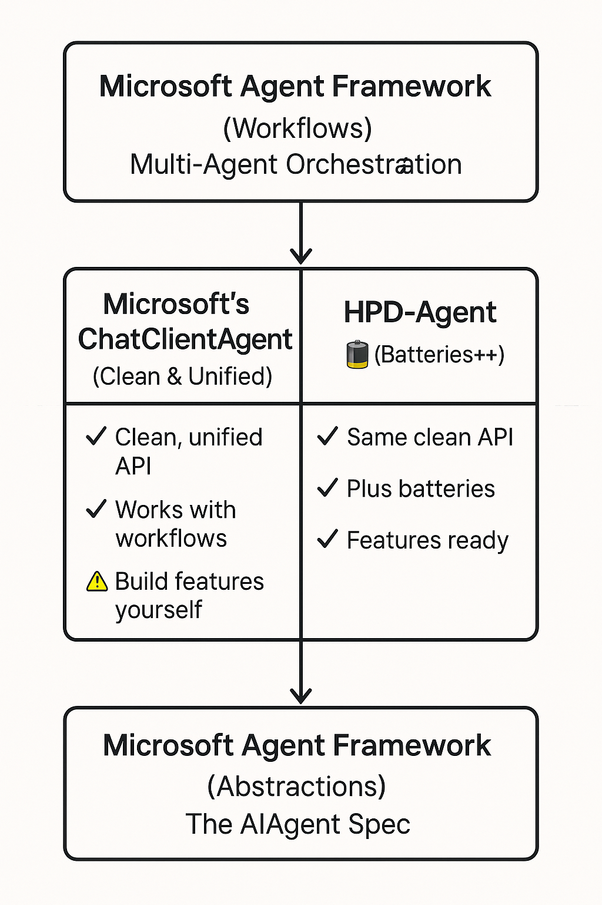

# HPD-Agent

**Microsoft Agent Framework, Batteries Included**

---

## What is HPD-Agent?

**HPD-Agent is a production-ready, batteries-included implementation of the Microsoft Agent Framework.**


### How It Fits In

Microsoft created three excellent pieces for .NET AI agents:

1. **The Abstractions** (`Microsoft.Agents.AI.Abstractions`) - The `AIAgent` spec that defines what an agent should be
2. **The Core Implementation** (`ChatClientAgent`) - A clean, unified agent implementation
3. **The Workflows** (`Microsoft.Agents.AI.Workflows`) - Multi-agent orchestration

**HPD-Agent is an enhanced implementation of #2 - building on the same abstractions with additional production features.**



**Both implement the same `AIAgent` spec. HPD just comes with batteries.**

- Use Microsoft's abstractions ✅
- Use Microsoft's workflows ✅
- **Enhance with HPD's batteries-included version** 🔋

---

## Why Choose HPD-Agent?

### Microsoft's ChatClientAgent (What You Get)

```csharp
var agent = new ChatClientAgent(
    chatClient,
    instructions: "Be helpful",
    name: "Assistant"
);
```

**Clean and unified, as designed:**
- ✅ Implements `AIAgent` spec
- ✅ Works with workflows
- ✅ Cleaner than Semantic Kernel
- ✅ Straightforward API
- ⚠️ Production features: build yourself

**Microsoft focused on clean abstractions. That's the right choice for a framework.**

### HPD-Agent (Batteries Included)

```csharp
var agent = new AgentBuilder(config)
    .WithProvider(ChatProvider.OpenAI, "gpt-4o")
    // TODO: Add actual builder methods here
    .Build();
```

**Everything you need for production:**
- ✅ Implements same `AIAgent` spec
- ✅ Works with same workflows
- ✅ Enterprise features built-in
- ✅ Production-ready tooling
- ✅ Comprehensive capabilities

**HPD-Agent: Same clean abstractions + batteries for production**

---

## For Semantic Kernel Users

If you're coming from Semantic Kernel, you know the journey: SK reached GA, then moved to maintenance mode as Microsoft shifted focus to Agent Framework. That's a lot of change.

**HPD-Agent offers a different approach:**

**Stable Foundation**
- Built on Agent Framework's `AIAgent` spec (benefits from Microsoft's architecture)
- Independent feature development (not subject to Microsoft's roadmap shifts)
- Closed-source business model provides predictable support (like Claude SDK)

**Feature Continuity**
- Powerful Semantic Kernel features that didn't make it into Agent Framework? We kept them (enhanced)
- Agent Framework's clean abstractions? We implement them
- New production capabilities? We add them

**One Migration**
- Move from SK → HPD-Agent once
- No waiting to see if Agent Framework is "the final answer"
- Get production-ready features now, not in 6-12 months

### The Best of Both Worlds

Migrating from Semantic Kernel? HPD-Agent brings:

✅ **Clean abstractions** from Agent Framework (no legacy baggage)
✅ **Features you loved** from Semantic Kernel (advanced and enhanced)
✅ **Independent roadmap** (features stay, even if Microsoft changes direction)

### Features Semantic Kernel Had That Agent Framework Doesn't

Many powerful Semantic Kernel features didn't make it into Microsoft Agent Framework. HPD-Agent brings them back - improved and built on the clean foundation:

<!-- TODO: Add specific SK features that are in HPD but not in Agent Framework -->

#### Feature 1: [SK Feature Name]
**In Semantic Kernel:** [Brief description]
**In Agent Framework:** Not included
**In HPD-Agent:** ✅ [Enhanced/Advanced implementation]

```csharp
// TODO: Add code example
```

---

#### Feature 2: [SK Feature Name]
**In Semantic Kernel:** [Brief description]
**In Agent Framework:** Not included
**In HPD-Agent:** ✅ [Enhanced/Advanced implementation]

```csharp
// TODO: Add code example
```

---

#### Feature 3: [SK Feature Name]
**In Semantic Kernel:** [Brief description]
**In Agent Framework:** Not included
**In HPD-Agent:** ✅ [Enhanced/Advanced implementation]

```csharp
// TODO: Add code example
```

---

_[Additional SK features to be documented]_

### Migration from Semantic Kernel

HPD-Agent makes migration straightforward:

```csharp
// Before (Semantic Kernel)
// TODO: Add SK example

// After (HPD-Agent)
// TODO: Add HPD equivalent
```

**What you gain:**
- ✅ Clean Agent Framework abstractions
- ✅ Features you relied on in SK
- ✅ Plus new batteries (permissions, AGUI, etc.)
- ✅ No legacy constraints

---

## The Three-Layer Stack

```
YOUR APPLICATION
       ↓
┌─────────────────────────────────────────┐
│   Microsoft Workflows (Keep)            │  ← Use for multi-agent orchestration
│   WorkflowBuilder, GroupChat, etc.      │
└─────────────────┬───────────────────────┘
                  ↓
┌─────────────────────────────────────────┐
│   ChatClientAgent     or   HPD-Agent 🔋 │  ← Choose: DIY or batteries-included
│   (Clean Foundation)       (Foundation+)│
└─────────────────┬───────────────────────┘
                  ↓
┌─────────────────────────────────────────┐
│   Microsoft Abstractions (Keep)         │  ← Foundation stays the same
│   AIAgent, AgentThread, etc.            │
└─────────────────────────────────────────┘
```

**Swap the middle layer. Keep everything else.**

---

## What's Included (The Batteries 🔋)

_Features to be documented - placeholder sections below_

### Feature Category 1: Core Capabilities
<!-- TODO: Document core features -->

### Feature Category 2: Enterprise Features
<!-- TODO: Document enterprise features -->

### Feature Category 3: Developer Experience
<!-- TODO: Document DX features -->

### Feature Category 4: Performance & Optimization
<!-- TODO: Document performance features -->

### Feature Category 5: Integration & Extensibility
<!-- TODO: Document integration features -->

---

## Quick Start

### Installation

```bash
dotnet add package HPD-Agent
dotnet add package HPD-Agent.Providers.OpenAI  # Or other providers
```

### Replace ChatClientAgent

**Before (Microsoft's basic implementation):**
```csharp
using Microsoft.Agents.AI;

var agent = new ChatClientAgent(
    chatClient,
    instructions: "Be helpful",
    name: "Assistant"
);
```

**After (HPD's batteries-included implementation):**
```csharp
using HPD_Agent;

var config = new AgentConfig
{
    Name = "Assistant",
    Provider = new ProviderConfig
    {
        Provider = ChatProvider.OpenAI,
        ModelName = "gpt-4o"
    }
};

var agent = new AgentBuilder(config)
    .WithAPIConfiguration(configuration)
    // TODO: Add actual builder methods
    .Build();
```

**Both implement `AIAgent`. Both work in workflows. HPD just has batteries.**

---

### Works in Microsoft Workflows

```csharp
using Microsoft.Agents.AI.Workflows;

// Create HPD agents (with batteries)
var researchAgent = new AgentBuilder(researchConfig)
    .WithAPIConfiguration(configuration)
    // TODO: Add research-specific features
    .Build();

var codingAgent = new AgentBuilder(codingConfig)
    .WithAPIConfiguration(configuration)
    // TODO: Add coding-specific features
    .Build();

// Use in Microsoft's workflow system (no changes needed)
var workflow = new WorkflowBuilder()
    .AddExecutor(researchAgent, "researcher")
    .AddExecutor(codingAgent, "coder")
    .AddRoute("start", route => route
        .When(msg => msg.Contains("search")).To("researcher")
        .When(msg => msg.Contains("code")).To("coder"))
    .Build();

await workflow.RunAsync(messages);
```

**Microsoft's orchestration + HPD's batteries = Best of both worlds**

---

## Architecture

```
┌─────────────────────────────────────────────────────────┐
│              Your Application                           │
└────────────────┬────────────────────────────────────────┘
                 │
                 ▼
┌─────────────────────────────────────────────────────────┐
│    Microsoft.Agents.AI.Workflows (Keep)                │
│    Multi-agent orchestration                            │
└────────────────┬────────────────────────────────────────┘
                 │
                 ▼
┌──────────────────────────┬──────────────────────────────┐
│  ChatClientAgent         │  HPD-Agent 🔋                │
│  (Microsoft's clean impl)│  (Enhanced alternative)      │
│                          │                              │
│  Implements:             │  Implements:                 │
│  └─ AIAgent              │  └─ AIAgent (same spec!)     │
│                          │                              │
│  Features:               │  Features:                   │
│  └─ Clean, unified API   │  ├─ Same clean API           │
│                          │  └─ Plus batteries           │
│                          │     (see docs for full list) │
└──────────────────────────┴──────────────────────────────┘
                 │
                 ▼
┌─────────────────────────────────────────────────────────┐
│    Microsoft.Agents.AI.Abstractions (Keep)             │
│    AIAgent, AgentThread, RunAsync(), etc.              │
└─────────────────────────────────────────────────────────┘
                 │
                 ▼
┌─────────────────────────────────────────────────────────┐
│         Microsoft.Extensions.AI                         │
│         IChatClient, AIFunction, etc.                   │
└─────────────────────────────────────────────────────────┘
```

**Same foundation. Same orchestration. Better implementation.**

---

## Microsoft Compatibility

| Microsoft Component | HPD-Agent |
|-------------------|-----------|
| `AIAgent` abstraction | ✅ Implements |
| `AgentThread` | ✅ `ConversationThread` extends it |
| `RunAsync()` | ✅ Full implementation |
| `RunStreamingAsync()` | ✅ Enhanced with additional capabilities |
| `WorkflowBuilder` | ✅ Drop-in compatible |
| `GroupChatWorkflowBuilder` | ✅ Works seamlessly |
| `GetNewThread()` | ✅ Supported |
| Thread serialization | ✅ Supported |
| Service discovery | ✅ Supported |

**You're not abandoning Microsoft's framework. You're using a better implementation of it.**

---

## Comparison

| Feature | Microsoft's ChatClientAgent | HPD-Agent |
|---------|----------------------------|-----------|
| **Implements AIAgent** | ✅ Yes | ✅ Yes |
| **Works in Workflows** | ✅ Yes | ✅ Yes |
| **Production Features** | ❌ Build yourself | ✅ Built-in |
| **Enterprise Tooling** | ❌ Build yourself | ✅ Built-in |
| **Advanced Capabilities** | ❌ Not available | ✅ Built-in |
| **Developer Experience** | ⚠️ Basic | ✅ Enhanced |
| **Time to Production** | 6-12 months DIY | Hours |

<!-- TODO: Add specific feature comparisons once documented -->

---

## Why Replace?

**Keep using Microsoft's:**
- ✅ Abstractions (`AIAgent`, `AgentThread`)
- ✅ Workflows (orchestration)
- ✅ Extensions.AI ecosystem

**Choose HPD for:**
- 🔋 Same abstractions + batteries included
- 🔋 Production features out-of-the-box

**Result**: Microsoft's clean architecture + everything you need for production

---

## Documentation

- **[Getting Started Guide](docs/getting-started.md)** _(coming soon)_
- **[Agent Developer Documentation](docs/Agent-Developer-Documentation.md)**
- **[Configuration Reference](docs/configuration-reference.md)** _(coming soon)_
- **[Migration from ChatClientAgent](docs/migration-guide.md)** _(coming soon)_
- **[API Reference](docs/api-reference.md)** _(coming soon)_

---

## Examples

Explore complete examples in the [`examples/`](examples/) directory:

- Basic agent setup
- Using HPD agents in Microsoft workflows
- Multi-provider configurations
- Advanced features and patterns

_(More examples to be added)_

---

## FAQ

### Is this compatible with Microsoft Agent Framework?

**Yes, 100%.** We implement the exact same `AIAgent` specification that `ChatClientAgent` implements. We're an enhanced alternative built on the same foundation.

### Can I use Microsoft's workflows?

**Absolutely!** Both `ChatClientAgent` and HPD-Agent implement `AIAgent`, so both work seamlessly in Microsoft workflows. Choose based on whether you want to build features yourself or get them included.

### Do I have to choose between Microsoft and HPD?

**No.** You're not choosing between Microsoft and HPD. You're using Microsoft's abstractions and workflows with HPD's implementation.

```
Microsoft Abstractions ✅
Microsoft Workflows ✅
HPD Implementation ✅
= All three working together
```

### Why not just use ChatClientAgent?

`ChatClientAgent` is exactly what Microsoft designed - a clean, unified implementation free of Semantic Kernel's legacy baggage. It's excellent for that purpose.

HPD-Agent builds on the same clean foundation but adds batteries: permissions, memory, cost optimization, Native AOT, and more. If you want those features built-in rather than building them yourself, that's where HPD-Agent fits.

### Why not contribute these features to Microsoft?

Microsoft Agent Framework focuses on providing clean abstractions and letting the ecosystem build on top. That's the right approach for a framework.

HPD-Agent focuses on providing a batteries-included implementation for teams that want production features immediately. Different goals, complementary products.

### Is this open source?

HPD-Agent is **closed source**, similar to how Claude provides their SDK. We provide a production-ready, batteries-included implementation of Microsoft's specification.


### Can Microsoft add these features to ChatClientAgent?

Microsoft's design philosophy for Agent Framework is to provide clean, unopinionated abstractions that the ecosystem can build on. That's a valid approach.

HPD-Agent is one implementation of that vision - opinionated, batteries-included, production-focused. The ecosystem can support both approaches.

---

## The Story: Why HPD-Agent Exists

### The Problem: Legacy Baggage

We started with **Semantic Kernel** - Microsoft's pioneering AI orchestration framework. It was groundbreaking, but suffered from a common problem: **early exploration decisions became permanent constraints**.

Semantic Kernel's team learned valuable lessons through real-world usage. This led them to create **Microsoft.Extensions.AI** - a cleaner foundation with better patterns. But here's the catch-22: Semantic Kernel had already reached v1.0, which meant maintaining backwards compatibility with APIs they knew weren't optimal.

**The result?** An over-abstracted framework trying to retrofit new foundations while carrying legacy decisions. Innovation constrained by compatibility.

### The Vision: Start Fresh, Start Right

In 2024, we saw an opportunity: build on the **new** foundation (`Microsoft.Extensions.AI`) without the baggage. Design an agent framework with fundamental architectural requirements from day one:

- **Native AOT Compatible** - Cloud-native from the start, not retrofitted
- **Event-Driven** - Real-time UI integration as a first-class citizen
- **Dual-Conscious** - Both console and web UI experiences considered
- **Highly Serializable** - Configuration-first architecture
- **Resilient** - Production-grade error handling and recovery
- **Protocol Agnostic** - Yet adaptive to provider specifics
- **Safe** - Security and permissions built-in, not bolted-on

### The Philosophy: Higher Place Design

Our motto: **"Make the simple things simple, and the complex things possible."**

No over-abstraction. No legacy compromises. Just clean patterns that work for both quick prototypes and enterprise deployments.

We spent 6 months building this vision.

### The Convergence

Then Microsoft released the **Agent Framework** - a clean specification for what agents should be, built on the same modern foundation we chose.

**Perfect timing.** They provided:
- Excellent abstractions (`AIAgent`, `AgentThread`)
- Powerful orchestration (Workflows)
- A minimal reference implementation (`ChatClientAgent`)

We had:
- A batteries-included implementation
- 6 months of production-focused design
- All the features enterprises actually need

**The synergy was obvious:** Keep Microsoft's architecture, replace their basic implementation with our production-ready one.

### The Result

HPD-Agent isn't a competitor to Microsoft Agent Framework - it's the **production implementation** they didn't build. We implement their spec, work with their workflows, and prove that their architecture works at scale.

**Microsoft provides the blueprint. We provide the building.** 🔋

---

## Support

- **Documentation**: [docs.hpd-agent.com](https://docs.hpd-agent.com) _(coming soon)_
- **Issues**: [GitHub Issues](https://github.com/yourorg/hpd-agent/issues)
- **Email**: [support@hpd-agent.com](mailto:support@hpd-agent.com)
- **Discord**: [Join our community](https://discord.gg/hpd-agent) _(coming soon)_

---

## License

Proprietary. See [LICENSE.md](LICENSE.md) for details.

---

<div align="center">

**HPD-Agent: Microsoft Agent Framework, Batteries Included 🔋**

**Same abstractions · Same workflows · Better implementation**

[Get Started](docs/getting-started.md) · [Documentation](docs/) · [Contact Us](mailto:contact@hpd-agent.com)

</div>
