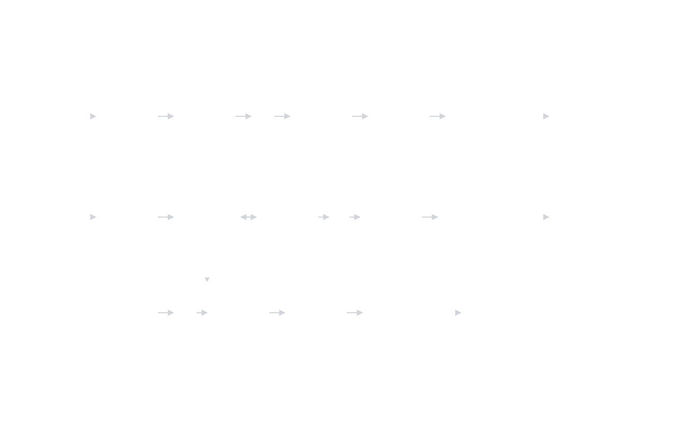

# HPD AI Framework

[](https://github.com/HPD-AI/HPD-Agent-Framework)
[](https://hpd-ai.github.io/HPD-Agent-Framework/)
[](https://www.nuget.org/packages/HPD-Agent.Framework)

A C# framework for building production AI systems — agents, RAG pipelines, and everything in between.

<picture>
  <source media="(prefers-color-scheme: dark)" srcset="overview-dark.svg">
  <source media="(prefers-color-scheme: light)" srcset="overview.svg">
  
</picture>

> [!WARNING]
> **HPD AI Framework is currently in an early development phase.**
>
> Until the release of version **1.0**, the API, inner mechanisms and naming are subject to significant changes without notice.

---

## HPD-Agent

Production-ready agent framework — tools, multi-turn conversations, middleware, sub-agents, multi-agent workflows, audio, and more. Paired with TypeScript/Svelte UI libraries for streaming chat interfaces.

<picture>
  <source media="(prefers-color-scheme: dark)" srcset="architecture-dark.svg">
  <source media="(prefers-color-scheme: light)" srcset="architecture.svg">
  
</picture>

### Install

```bash
dotnet add package HPD-Agent.Framework
```

### Quick Start

```csharp
using HPD.Agent;

var agent = await new AgentBuilder()
    .WithProvider("openai", "gpt-4o")
    .WithInstructions("You are a helpful assistant.")
    .BuildAsync();

await foreach (var evt in agent.RunAsync("Hello!"))
{
    if (evt is TextDeltaEvent delta)
        Console.Write(delta.Text);
}
```

### What's Inside

- **Tools** — AIFunctions, Skills, SubAgents with source-generated wiring. MCP servers, OpenAPI specs, or runtime-provided.
- **Sessions & Branches** — Conversation history with forking. Automatic crash recovery.
- **Sub-Agents** — Child agents with own tools, provider, and memory. Stateful, per-session, or one-shot.
- **Middleware** — Intercept every stage. Built-in: CircuitBreaker, Retry, HistoryReduction, PII, FunctionTimeout, Logging.
- **Multi-Agent Workflows** — Directed graph composition with conditional routing.
- **Evaluation** — LLM-as-judge scoring, decompose-verify evaluators, score store, and human-in-the-loop annotation queue.
- **Event Streaming** — 50+ event types streamed in real time. Bidirectional flows for permissions and continuations.
- **Memory & Content Store** — ISessionStore, IContentStore, and agent working memory.
- **Audio** — Native audio input/output for voice agents.
- **Observability** — OpenTelemetry integration with automatic span hierarchy.

### TypeScript Libraries

| Package | Purpose |
|---------|---------|
| `@hpd/hpd-agent-client` | Lightweight event stream consumer — browser & Node.js, SSE/WebSocket/MAUI transports |
| `@hpd/hpd-agent-headless-ui` | Svelte 5 headless component library — < 20 KB gzipped, 12+ components |

### Documentation

Full docs at [hpd-ai.github.io](https://hpd-ai.github.io/HPD-Agent-Framework/) — or browse [documentation/](documentation/).

---

## HPD-RAG

Fully modular RAG framework — every node in every pipeline is swappable or removable. Build your own ingestion, retrieval, and evaluation pipelines by snapping blocks together.

<picture>
  <source media="(prefers-color-scheme: dark)" srcset="rag-architecture-dark.svg">
  <source media="(prefers-color-scheme: light)" srcset="rag-architecture.svg">
  
</picture>

> **Coming soon.** HPD-RAG is under active development. Documentation and packages will be available with the next release.
